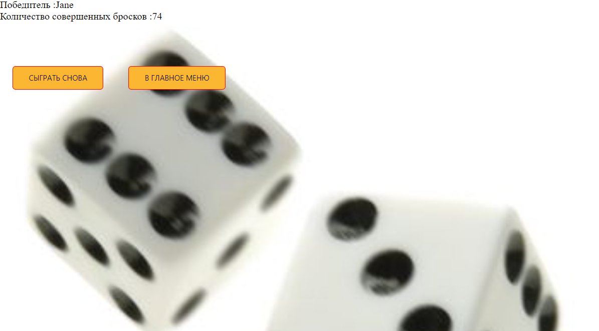

# 
 Небольшой проект разработан в качестве обучающей практики на PHP и JS.

 Проект игра содержит в себе несколько игр: "Четное нечетное" , "Три кубика" и "Больше меньше". Стартовая страница содержит меню выбора одной из игр. Далее правила по каждой игре описаны уже для каждой игры отдельно.

## Используемые технологии

## Пример работы кода 

## Как открыть/запустить

Воспользуйтесь установленным web-сервером OpenServer.